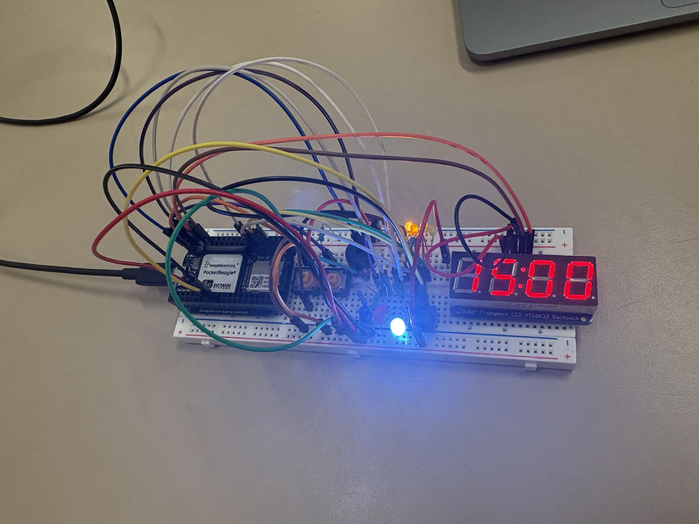

# Project 01 - Pomodoro Timer

**Author:** Pedro Cardon Unikovski
**Course:** EDES 301
**Platform:** PocketBeagle

📖 **For full build instructions, visit the project on Hackster.io:**
[https://www.hackster.io/pc67/adjustable-pomodoro-study-timer-914deb](https://www.hackster.io/pc67/adjustable-pomodoro-study-timer-914deb)

---



## Schematic


---

## Overview

A hardware Pomodoro Timer built on the PocketBeagle. The user sets the study duration using a potentiometer, then starts the timer with a button. The timer runs 4 study cycles separated by short breaks, followed by a long break after all cycles complete. A buzzer plays a song at the end of each session, and LEDs provide visual feedback on the current state.

---

## How It Works

1. Turn the **potentiometer** to set your desired study duration (15–45 minutes)
2. Press the **left button** to start the timer
3. The **7-segment display** counts down in MM:SS
4. After each study session the buzzer plays a song and a short break begins
5. After 4 complete cycles, a long break is triggered and "Happy Birthday" plays
6. Press the **right button** at any time to reset

### Timer Structure

| Phase        | Duration              |
|--------------|-----------------------|
| Study        | 15–45 min (set by potentiometer) |
| Short Break  | 5 minutes             |
| Long Break   | 10 minutes (after 4 cycles) |
| Cycles       | 4                     |

---

## LED Indicators

| LED          | Color  | Meaning                        |
|--------------|--------|--------------------------------|
| Blue LED     | Blue   | Study session in progress      |
| Red LED      | Red    | Break in progress              |
| White LED    | White  | Timer is running (not paused)  |
| Yellow LEDs  | Yellow | Current cycle number (1–4)     |

---

## Button Controls

| Button | Action                        |
|--------|-------------------------------|
| Left  | Start / Pause / Resume timer  |
| Right | Reset timer                   |

---

## Hardware & Pin Assignments

| Component         | Pin(s)                          | Notes                     |
|-------------------|---------------------------------|---------------------------|
| HT16K33 Display   | P2_09 (SDA), P2_11 (SCL)        | I2C Bus 1, Address 0x70   |
| Buzzer            | P2_01                           | PWM                       |
| Potentiometer     | P1_19                           | ADC (1.8V max)            |
| Left Button      | P2_03                            | GPIO input                 |
| Right Button       | P2_02                          | GPIO input                |
| Blue LED          | P2_04                           | GPIO output               |
| Red LED           | P2_06                           | GPIO output               |
| White LED         | P2_08                           | GPIO output               |
| Yellow LEDs (x4)  | P2_27, P2_29, P2_31, P2_33     | GPIO output               |

---

## File Structure

```
project_01/
├── project_01.py       # Main application - Pomodoro loop and logic
├── button.py           # Button driver (GPIO input, press/release detection)
├── buzzer.py           # Buzzer driver (PWM tone playback)
├── buzzer_music.py     # Music driver (note library + songs)
├── configure_pins.sh   # Shell script to configure PocketBeagle pin modes
├── ht16k33.py          # HT16K33 I2C 7-segment display driver
├── led.py              # LED driver (GPIO output)
├── potentiometer.py    # Potentiometer driver (ADC input)
└── .gitignore          # Excludes __pycache__ and compiled Python files
```

---

## Songs

| Event                  | Song                |
|------------------------|---------------------|
| End of study session   | Super Mario Theme   |
| End of break           | Tetris Theme        |
| All 4 cycles complete  | Happy Birthday      |

---

## Setup & Running

### 1. Configure pins
```bash
cd project_01
bash configure_pins.sh
```

### 2. Run the timer
```bash
sudo python3 project_01.py
```

### 3. Stop the timer
Press `Ctrl+C` in the terminal — the program will clean up all hardware automatically.

---

## Dependencies

- `Adafruit_BBIO` — GPIO, PWM, and ADC control on the PocketBeagle
- Python 3.7+
